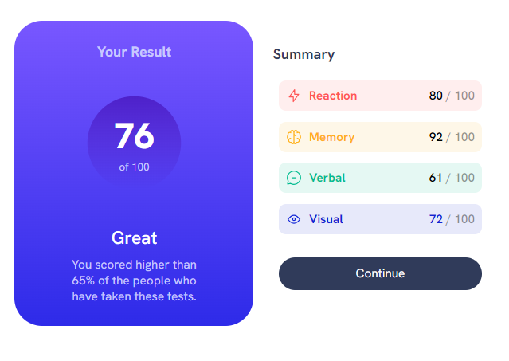
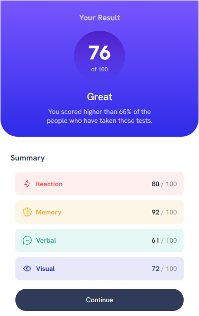

# Frontend Mentor - Results summary component solution

This is a solution to the [Results summary component challenge on Frontend Mentor](https://www.frontendmentor.io/challenges/results-summary-component-CE_K6s0maV).

## Table of contents

- [Overview](#overview)
  - [The challenge](#the-challenge)
  - [Screenshot](#screenshot)
- [My process](#my-process)
  - [Built with](#built-with)
  - [What I learned](#what-i-learned)
  - [Continued development](#continued-development)

## Overview

### The challenge

Users should be able to:

- View the optimal layout for the interface depending on their device's screen size
- See hover and focus states for all interactive elements on the page

### Screenshot

## My process

### Built with

- Semantic HTML5 markup
- CSS custom properties
- Flexbox
- Mobile-first workflow

### What I learned

1.any margin with the elements that have vw , vh make scrollbar vertically and horizontally.
2.the best way to align items with each other is use of flexbox
3.start coding from overall structure to the details is really good approach vs get drown with details in first place
4.I really need to practice. really!! :)

### Continued development

I want to continue working on CSS capabilities to create a responsive design. It was really difficult to adjust the arrangement of the elements on the page and their relationship with each other correctly
